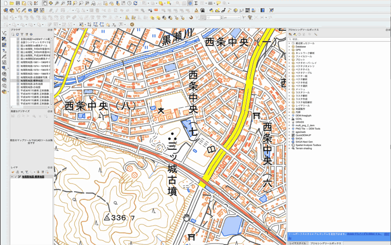
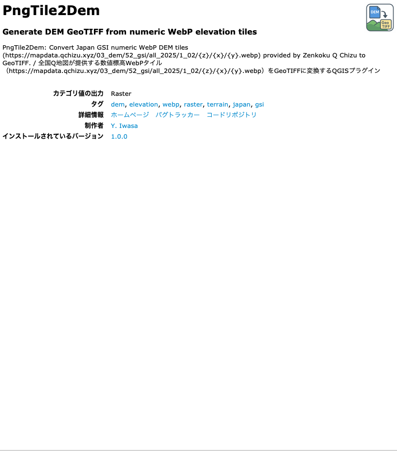
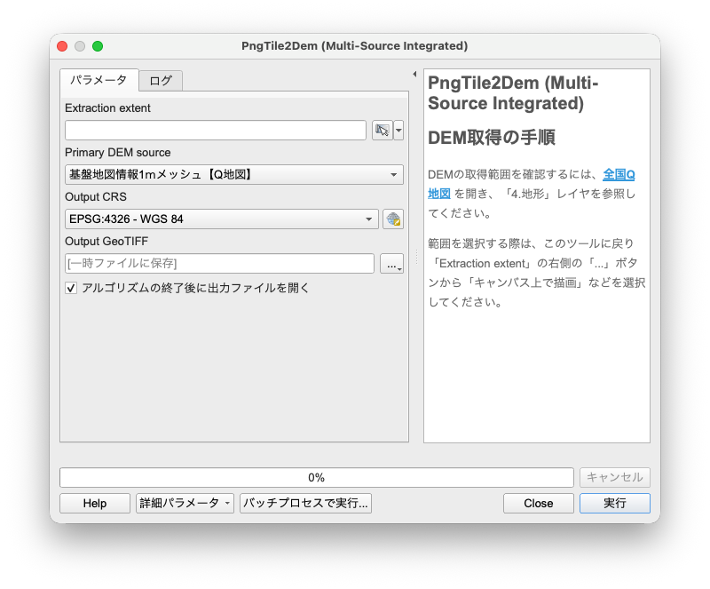

# PngTile2Dem (QGIS Plugin)

# 日本語 — Japanese

PngTile2Dem は、日本国内の様々な機関（国土地理院、産総研、林野庁、全国Q地図など）から提供されている **数値標高タイル** を取得し、それらを統合・補完して高品質な **GeoTIFF（DEM）** を生成する QGIS プラグインです。
---

## 主な機能

- ✔ **マルチソース統合**: 全国Q地図、産総研（0.5m/0.25mメッシュ）、林野庁（0.5mメッシュ）など最新のLiDAR成果に対応。
- ✔ **インテリジェント合成**: 選択した優先ソースにデータがない場合、自動的にQ地図や地理院10mメッシュで欠損を補完。
- ✔ **任意座標系出力**: 平面直角座標系（JGD2011）など、解析に最適なCRSで直接保存。
- ✔ **高速処理**: マルチスレッドによる並列ダウンロード。

---

## インストール方法

1. ZIP をダウンロード  
2. QGIS → **プラグイン → プラグインの管理とインストール → ZIP からインストール**  
3. ZIP を選択してインストール  
4. 処理ツールボックスの **DEM Tools → PngTile2Dem** に表示されます

---

## 使い方

1. QGISのツールボックスから **PngTile2Dem (Multi-Source Integrated)** を起動。
2. **Extraction extent**: 取得したい範囲をキャンバス上で指定。
3. **Primary DEM source**: 最優先で使いたいデータ源を選択。
4. **Output CRS**: 解析に使いたい座標系（例：EPSG:6677 等）を選択。
5. 実行すると、タイルがダウンロード・合成され、GeoTIFFとしてプロジェクトに追加されます。

プラグインは以下を自動で実行：
- 必要なタイルのダウンロード  
- VRT の作成  
- 最終 CRS への Warp  
- GeoTIFF の生成  
- QGIS に自動追加  

---

## スクリーンショット

### 実行デモ

### プラグイン画面

### 処理ツール画面

### 出力された DEM の表示例

---

## 注意点

- 推奨最大範囲：**30,000 タイル以下**  

---

## ライセンス

MIT ライセンスで公開しています。  
詳細は `LICENSE` を参照してください。

---

## データ出典および利用条件について

本プラグインは、全国Q地図が国土地理院から以下のとおり測量法に基づく使用承認を得て、Q地図タイルや産総研および林野庁、自治体が公開している以下の標高データを元に、
タイルの取得・復号・再サンプリング・モザイク処理を行い、派生的な DEM を生成します。
指定した範囲の一部でタイルが存在しない場合には地理院タイル DEM5AやDEM5B、DEM5C、DEM10Bで補完されます。

本プラグインおよび生成される DEM は、
**国土地理院コンテンツ利用規約**（ https://www.gsi.go.jp/kikakuchousei/kikakuchousei40182.html ） および **Q地図タイルの利用方法** （ https://info.qchizu.xyz/qchizu/reprint/ ） に基づいて利用可能です。

タイル提供元：  
基盤地図情報1ｍメッシュ【Q地図】	
https://mapdata.qchizu.xyz/03_dem/52_gsi/all_2025/1_02/{Z_QMAP}/{x}/{y}.webp

宮城県0.5mメッシュ【林野庁】	
https://forestgeo.info/opendata/4_miyagi/dem_2023/{z}/{x}/{y}.png

2021〜2022年栃木県0.5mメッシュ【産総研】	
https://tiles.gsj.jp/tiles/elev/tochigi/{z}/{y}/{x}.png

2022〜2023年度東京都0.25mメッシュ【産総研】
https://tiles.gsj.jp/tiles/elev/tokyo/{z}/{y}/{x}.png

2019〜2022年度神奈川県0.5mメッシュ【産総研】
https://tiles.gsj.jp/tiles/elev/kanagawa/{z}/{y}/{x}.png

2021年富山県0.5mメッシュ【林野庁】
https://forestgeo.info/opendata/16_toyama/dem_2021/{z}/{x}/{y}.png

2024年石川県能登0.5mメッシュ【Q地図】	
https://mapdata.qchizu2.xyz/03_dem/59_rinya/noto_2024/0pt5_01/{z}/{x}/{y}.png

2020年度石川県能登西部0.5mメッシュ【Q地図】	
https://mapdata.qchizu.xyz/94dem/17p/ishikawa_f_02_g/{z}/{x}/{y}.png

2022年度石川県能登東部0.5mメッシュ【Q地図】	
https://mapdata.qchizu.xyz/94dem/17p/ishikawa_f_01_g/{z}/{x}/{y}.png

2024年山梨県0.5mメッシュ【林野庁】	
https://forestgeo.info/opendata/19_yamanashi/dem_2024/{z}/{x}/{y}.png

静岡県0.5mメッシュ【産総研】	
https://tiles.gsj.jp/tiles/elev/shizuoka/{z}/{y}/{x}.png

滋賀県0.5mメッシュ【林野庁】	
https://forestgeo.info/opendata/25_shiga/dem_2023/{z}/{x}/{y}.png

2019〜2023年京都府0.5mメッシュ【林野庁】	
https://forestgeo.info/opendata/26_kyoto/dem_2024/{z}/{x}/{y}.png

2021〜2022年度兵庫県0.5mメッシュ【産総研】	
https://tiles.gsj.jp/tiles/elev/hyogodem/{z}/{y}/{x}.png

2018〜2023年度鳥取県0.5mメッシュ【鳥取県】	
https://rinya-tottori.geospatial.jp/tile/rinya/2024/gridPNG_tottori/{z}/{x}/{y}.png

岡山県0.5mメッシュ【林野庁】	
https://forestgeo.info/opendata/33_okayama/dem_2024/{z}/{x}/{y}.png

2019年愛媛県0.5mメッシュ【林野庁】	
https://forestgeo.info/opendata/38_ehime/dem_2019/{z}/{x}/{y}.png

2018年度高知県0.5mメッシュ【産総研】	
https://tiles.gsj.jp/tiles/elev/kochi/{z}/{y}/{x}.png

2022年長崎県0.5mメッシュ【林野庁】	
https://forestgeo.info/opendata/42_nagasaki/dem_2022/{z}/{x}/{y}.png

DEM5A
https://cyberjapandata.gsi.go.jp/xyz/dem5a_png/{z}/{x}/{y}.png

DEM5B
https://cyberjapandata.gsi.go.jp/xyz/dem5b_png/{z}/{x}/{y}.png

DEM5C
https://cyberjapandata.gsi.go.jp/xyz/dem5c_png/{z}/{x}/{y}.png

DEM10B
https://cyberjapandata.gsi.go.jp/xyz/dem_png/{z}/{x}/{y}.png

---

### 生成される DEM の注意事項

本プラグインで生成される GeoTIFF DEM は、
国土地理院が提供する元データを加工・統合した
**派生データ（非公式成果物）**です。

国土地理院が内容を保証するものではありません。

生成された DEM を再配布・公開する場合は、
以下のように元データの出典を明記してください：

> 例：「国土地理院、産総研、林野庁の標高データを加工して作成（PngTile2Demを使用）」

---

### 謝辞

高解像度標高データの公開およびタイル化にご尽力いただいた関係機関の方々に敬意を表するとともに深く感謝申し上げます。

本プラグインおよびソースコードの作成・改良にあたっては、
**OpenAI の ChatGPT** を用い、アルゴリズム設計、デバッグ、
コード整理および README 文書作成の補助を受けました。

最終的な設計判断、検証、動作確認はすべて作者自身が行っています。

---

## English

PngTile2Dem is a QGIS plugin that downloads numeric elevation WebP tiles provided by the National Land Information Division (GSI Japan, through Zenkoku Q Chizu), decodes RGB values into real elevation values, mosaics the tiles, and exports a DEM GeoTIFF in any CRS.

This plugin is optimized for:
- Fast parallel tile downloads
- Accurate RGB → elevation decoding
- Efficient VRT-based mosaicking
- Reliable GeoTIFF output with overviews for smooth display
- Output CRS selection (EPSG:4326, EPSG:3857, Japan Plane Rectangular CS 1–19, etc.)

---

## Features

- ✔ Download WebP numeric DEM tiles (Zoom level 17)
- ✔ Decode RGB-coded elevation values
- ✔ Mosaic tiles using GDAL VRT
- ✔ Reproject to any CRS
- ✔ GeoTIFF output with tiling, compression, overviews
- ✔ Multithreaded processing
- ✔ Estimated processing time before execution

Tile Source:  
Zenkoku Q Chizu
https://mapdata.qchizu.xyz/03_dem/52_gsi/all_2025/1_02/{z}/{x}/{y}.webp

DEM5A
https://cyberjapandata.gsi.go.jp/xyz/dem5a_png/{z}/{x}/{y}.png

DEM5B
https://cyberjapandata.gsi.go.jp/xyz/dem5b_png/{z}/{x}/{y}.png

DEM5C
https://cyberjapandata.gsi.go.jp/xyz/dem5c_png/{z}/{x}/{y}.png

DEM10B
https://cyberjapandata.gsi.go.jp/xyz/dem_png/{z}/{x}/{y}.png

---

## Installation

1. Download the ZIP file of this repository.
2. Open QGIS → **Plugins → Manage and Install Plugins → Install from ZIP**.
3. Select the ZIP file and install the plugin.
4. The plugin appears under **Processing Toolbox → DEM Tools → PngTile2Dem**.

---

## Usage

1. Define an extraction extent in the map canvas.
2. Select output CRS.
3. Choose output GeoTIFF file.
4. Run the tool.

The plugin will:
- Download necessary tiles
- Build a VRT
- Warp to the final CRS
- Save DEM GeoTIFF
- Add the layer automatically

---

## Screenshots

### Plugin execution example

*Example: Running the plugin and displaying the generated DEM in QGIS.*

### Plugin image

### Processing tool dialog

### Output DEM example

---

## Notes

- Recommended maximum area: ≤ ~20,000 tiles  
  (QGIS / GDAL performance may degrade beyond this)

---

## License

This plugin is released under the MIT License.  
See `LICENSE` for details.

---

## Data Sources and Usage Conditions

This plugin generates a derivative DEM by acquiring, decrypting, resampling, and mosaicking tiles based on the following elevation data published as Q Chizu tiles by the Zenkoku Q Chizu.
This data is provided under usage approval granted by the Geospatial Information Authority of Japan (GSI) based on the Surveying and Mapping Act.
If Q Chizu tiles are unavailable for part of the specified area, they are supplemented with GSI tiles such as DEM5A, DEM5B, DEM5C, or DEM10B.

This plugin and the generated DEM are available for use under the **Geospatial Information Authority of Japan Content Usage Terms** (https://www.gsi.go.jp/kikakuchousei/kikakuchousei40182.html) and the **Q Chizu Tile Usage Guidelines** (https://info.qchizu.xyz/qchizu/reprint/).

Tile Provider:  
Q Chizu Tiles  
https://mapdata.qchizu.xyz/03_dem/52_gsi/all_2025/1_02/{z}/{x}/{y}.webp

DEM5A
https://cyberjapandata.gsi.go.jp/xyz/dem5a_png/{z}/{x}/{y}.png

DEM5B
https://cyberjapandata.gsi.go.jp/xyz/dem5b_png/{z}/{x}/{y}.png

DEM5C
https://cyberjapandata.gsi.go.jp/xyz/dem5c_png/{z}/{x}/{y}.png

DEM10B
https://cyberjapandata.gsi.go.jp/xyz/dem_png/{z}/{x}/{y}.png

---

### Notes on Generated DEMs

The GeoTIFF DEMs generated by this plugin are
**derived data (unofficial products)** created by processing and integrating
the original data provided by the Geospatial Information Authority of Japan (GSI).

The Geospatial Information Authority of Japan does not guarantee its content.

When redistributing or publishing the generated DEM,
please clearly state the source as follows:

> “Created by processing Geospatial Information Authority of Japan digital elevation data (using PngTile2Dem processing)”

---

### Acknowledgement

This plugin and its source code were developed and refined with the assistance of
**ChatGPT (OpenAI)**, which was used to support algorithm design, debugging,
code refactoring, and documentation writing.

All final design decisions, testing, and validation were performed by the author.
